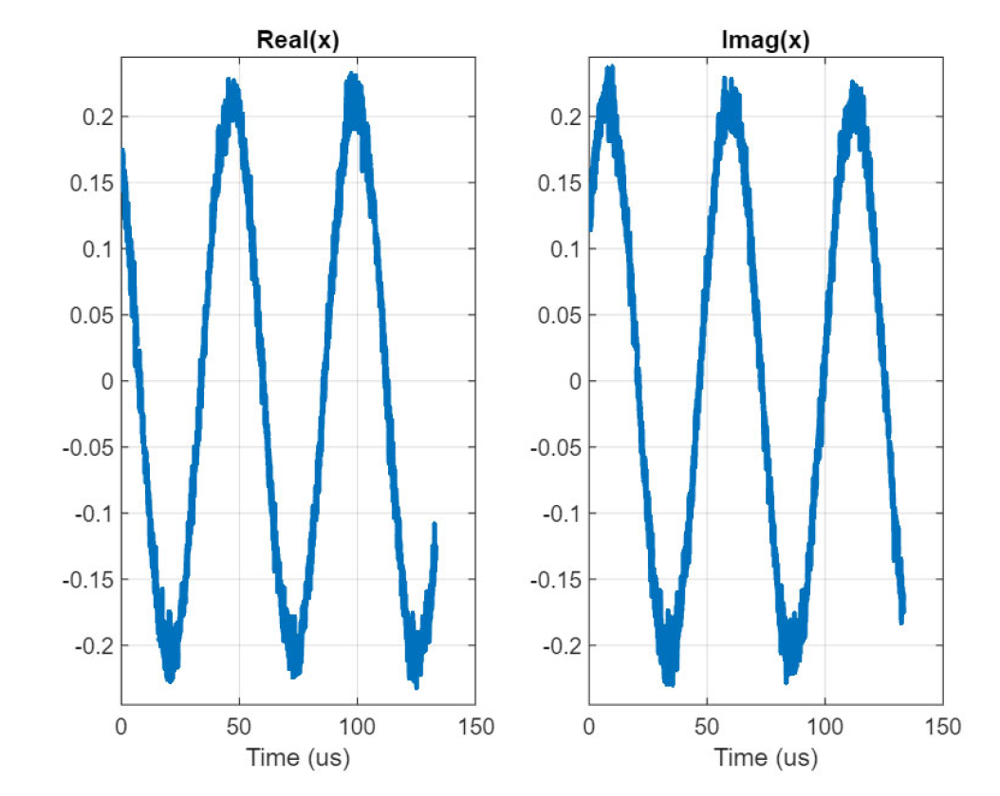

# Lab 1:  Capturing and Receiving Samples

[Sundeep Rangan](https://wireless.engineering.nyu.edu/sundeep-rangan/), Professor, ECE, New York University

The ADALM-Pluto  is a simple, but powerful software defined radio (SDR)
that is excellent for teaching basic concepts in digital communications and wireless.
In this first lab, you will learn to:
* Initalize and configure the ADALM-Pluto device
* Connect one or more Pluto devices to the host computer for single device loopback and two device communication links
* Transmit complex baseband samples in a repeated loop from a Pluto
* Receive a single frame of complex baseband sampes to perform offline processing
* Capture multiple frames and detect and visualize overflow.

The main file is samples.mlx:  [[Matlab]](./samples.mlx) [[PDF]](./samples.pdf)
