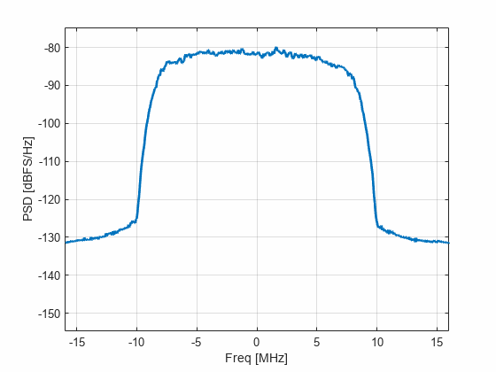

# Lab:  Symbol Mapping and TX Filtering

In this lab, you will learn to:
 
* Generate random QAM symbols
* Design and simulate a digital filter with upsampling
* Set the backoff for a TX signal 
* Measure the TX PSD 
* Build a simple spectrum analyzer

## Files: 
 
* `labTxFilt.mlx`:  Main file for the lab
* `TxFilt.m`:  Class used for performing the TX filtering and clipping

For the lab, complete the `TODO` sections in both files, run the script, and print to PDF.
Submit the PDF.  Do not submit the source code.
