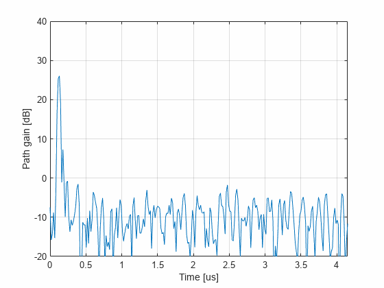

# Lab:  Multi-path channel models are widely-used in the simulating wireless systems.  

In this lab, we will build a simple simulator for a static multi-path channel.  We will also show how to build a channel sounder, which is a device that measures the channel response between a transmitter (TX) and receiver (RX).  Channel sounders are key for researchers studying wireless channel propagation.  They are also useful in bringing up any SDR platform to ensure the wideband response through the TX and RX chains is as expected.  Indeed,  after ensuring you can receive a tone correctly, use a channel sounder to make sure the device works and correctly characterize the TX and RX filters.

In going through this lab, you will learn to:

* Represent multi-path channels and download the 3GPP TDL multi-path model
* Simulate multi-path propagation with a fractional delay
* Measure the channel frequency response via frequency-domain correlation
* Compute the time-domain channel impulse response via an IFFT
* Align the channel impulse response via peak detection
* Build a continuous monitor for the channel 

## Files  
You will need:
* `chanSounder.mlx`:  This file, the main file for the lab
* `SISOChan.m`:  Class file for the main simulator.  You will use this in subsequent labs once done
* `estChanResp.m`:  Function for estimating the channel
* `TxFilt.m`:  Use the function that you created in the previous lab

## Submissions

Run the lab with Pluto devices with either one or two hosts.   Fill in all sections labeled TODO .  Print and submit the PDF.  Do not submit the source code.