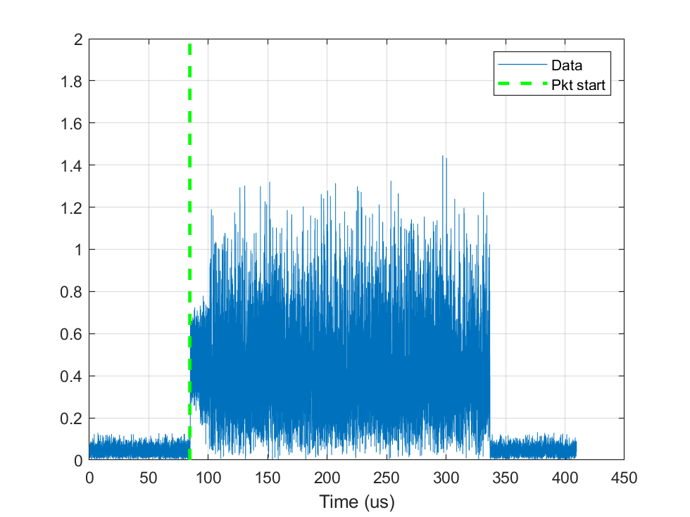

# MATLAB and SDR Lab: 802.11 Preamble Detection and Synchronization

In this lab, we build a simple preamble detector for the 802.11 Wireless LAN standard. In doing this lab, you will learn to:

* Construct 802.11 packets using the MATLAB WLAN toolbox
* Identify the preamble portions of the packet
* Implement a cyclic auto-correlation detector for the short training field (STF)
* Implement a matched filter detector for the long training field (LTF)
* Evaluate the performance of the detector in terms of missed detection and timing error
* Build a simple offline detector on the SDR
* Implement functions as MATLAB system objects

## File structure and submission  
To organize the simulation, I have provided several files for this lab:

* `wlamPreamble.mlx`: This file. The main script for the test.
* `WLANTx.m`: Class file for a WLAN transmitter
* `RandDelayChan.m`: Class file for a WLAN channel
* `WLANRx.m`: Class file for a WLAN receiver
* `TxFilt.m`:  Class file for the upsampling TX
* `RxFilt.m`:  Class file for the upsampling RX

You will need to complete all the `TODO` sections of all files.
Run the `wlanPreamble.mlx` live script. Print the script to PDF.
Do not submit source code.  No other formats accepted.
