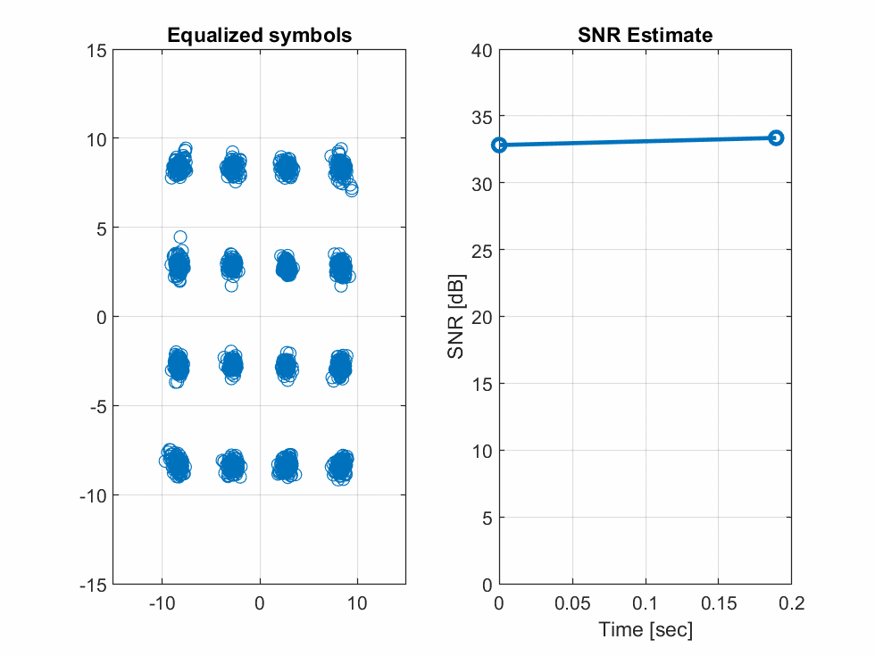

# SDR Lab: OFDM Demodulation and Equalization

This lab will build on the previous lab to perform the OFDM demodulation and equalization.  In doing this lab, you will learn to:

* Compute the parameters of an OFDM system
* Extract the payload and data components in an 802.11g packet
* Perform the OFDM demodulation of the components
* Build a simple channel estimator
* Equalize the symbols with estimated channel
* Visualize the equalized symbols

## Files:
The lab requires a set of files to complete.   The files are:

* `wlanEqualization.mlx`:  This file, which is the main file.
* `WLANPktAnalyzer.m`:  Class for analyzing the OFDM structure of the     transmitted data
* `WLANRx.m`:  Main RX class that performs the OFDM channel estimation and equalization
* `RandMPChan.m`: Class for creating a random multi-path channel

In addition, we will use several completed versions of files from the previous lab.  If you have completed these labs, you can use the solution you wrote.  NYU students in the class will also be provided the files in Brightspace.

* `WLANTx.m`:  Transmitter class. 
* `TxFilt.m`, `RxFilt.m`:  Classes for up and down-converting signals
* `WLANDetect.m`:  Class for detecting the packet
